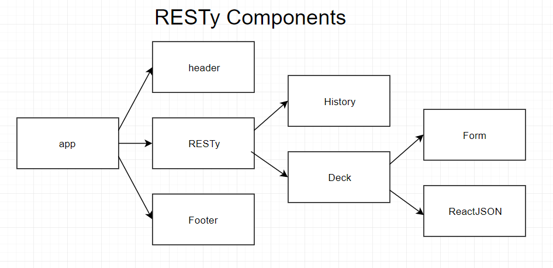
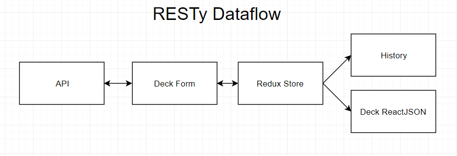

## RESTy pt2

### Author: Felipe Delatorre

### Links and Resources
* [submission PR](https://github.com/401-advanced-javascript-felipe/block5-RestyPt2/pull/1)
* [front-end](http://block5-restypt2.s3-website-us-west-2.amazonaws.com/)

#### Documentation
* styleguide - `npm run styleguide`

### Components

* `<app />`
  * `<header />`
  * `<resty />`
    * `<history />`
    * `<deck />`
      * `<deckForm />`
      * `<deckReactJSON />`
  * `<footer />`

### Setup
* `PORT` - Runs on port 3000

#### Running the app
* `npm start`
* Endpoint: `/`
  * Returns a React application that can make API calls

#### UML

